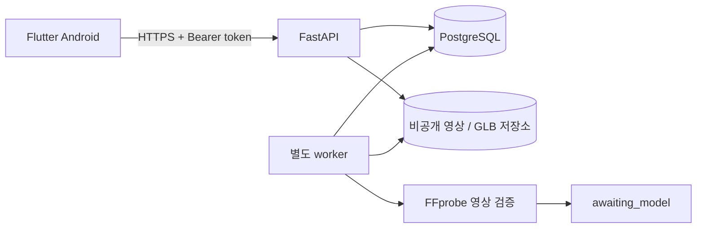

# 운영과 모델 연결 준비

## 실행 구조



`app` Compose 프로필은 단일 호스트용 API·worker·마이그레이션 서비스를 제공합니다.
DB는 기존 `postgres_data` 볼륨, 로컬 파일은 `media_data` 볼륨에 보존합니다.
API와 worker는 같은 이미지와 저장소 설정을 사용합니다. 별도 클라우드 계정이나 GPU는
필요하지 않습니다. 모델 학습과 추론, 사용자 체형 복원은 현재 실행 경로에 포함되지 않습니다.
앱 컨테이너는 비루트 사용자·읽기 전용 루트 파일시스템, 1.5 GiB 메모리·2 CPU·256 PID
한도를 사용합니다. 임시 저장소는 컨테이너별 512 MiB tmpfs이며 메모리 한도에 포함됩니다.
실제 동시 업로드량을 측정한 뒤 한도를 조정합니다.

## 환경변수

`infra/.env.example`에는 비밀이 없는 예시를 둡니다. 실제 값은 Git에서 제외된
`infra/.env` 또는 환경별 비밀 관리 도구로 주입합니다. API의 직접 실행에서는 환경변수가
`.env`보다 우선합니다. Compose는 `.env`를 컨테이너에 전달하고 내부 DB 주소·포트와
저장 경로를 컨테이너용 값으로 덮어씁니다.

| 설정 | 기본값 / 역할 |
| --- | --- |
| `POSTGRES_HOST`, `POSTGRES_PORT` | 직접 실행 `127.0.0.1:5432`, Compose 내부 `postgres:5432` |
| `POSTGRES_DB`, `POSTGRES_USER` | `tennis_ai` |
| `POSTGRES_PASSWORD` | 필수, 비밀 관리 대상 |
| `API_PORT` | Compose 호스트 포트 `8000` |
| `DATABASE_TIMEOUT_SECONDS` | DB 상태 검사 제한 시간 5초 |
| `AUTH_SESSION_HOURS` | 세션 유효 기간 24시간 |
| `AUTH_MAX_ATTEMPTS`, `AUTH_LOCKOUT_SECONDS` | 인증 시도 제한 10회 / 900초 |
| `MAX_UPLOAD_BYTES` | 파일당 262,144,000바이트 (250 MiB) |
| `MAX_VIDEO_SECONDS` | 영상 최대 120초 |
| `MAX_USER_STORAGE_BYTES` | 사용자별 원본 영상 2,147,483,648바이트 (2 GiB) |
| `STORAGE_BACKEND` | `local` 또는 `s3` |
| `STORAGE_LOCAL_PATH` | 직접 실행 `~/.local/share/tennis-ai/media`, Compose `/data/media` |
| `S3_BUCKET`, `S3_REGION`, `S3_ENDPOINT_URL` | 외부 S3 호환 저장소 설정, region 기본 `us-east-1` |
| `WORKER_POLL_SECONDS` | 큐 조회 간격 2초 |
| `WORKER_LEASE_SECONDS`, `WORKER_MAX_ATTEMPTS` | 중단된 작업 회수 기준 120초 / 최대 3회 |
| `WORKER_HEARTBEAT_PATH` | 직접 실행 `/tmp/tennis-ai-worker-heartbeat`, Compose `/data/media/worker-heartbeat` |

S3를 사용하면 API와 worker에 동일한 버킷과 권한을 부여합니다. 인증 정보는 표준 AWS
환경변수 또는 실행 역할을 사용하고 버킷은 비공개로 유지합니다. Compose의 `.env`에
값을 전달하거나 호스트의 비밀 주입 방식으로 연결합니다. 객체 버전 관리·수명 주기·암호화와
외부 백업 정책은 저장소 제공자에서 설정합니다. 로컬 백업 스크립트는 S3 모드에서 실행을 거부합니다.
미완료 multipart 업로드를 자동 중단하는 버킷 수명 주기 규칙도 설정하여 프로세스 강제 종료로
남은 전송 조각을 회수합니다.

## 시작·갱신·중지

```bash
docker compose --env-file infra/.env -f infra/compose.yaml --profile app up -d --build
docker compose --env-file infra/.env -f infra/compose.yaml --profile app ps
curl --fail http://127.0.0.1:8000/health/ready
```

API와 worker는 마이그레이션 성공 이후에 시작합니다. 애플리케이션 갱신 전 백업을 만들고,
변경된 리비전의 호환성을 확인합니다. 데이터 변경이 있는 운영 갱신에서는 먼저 API·worker를
중지한 후 새 이미지로 마이그레이션을 명시적으로 실행합니다.

```bash
docker compose --env-file infra/.env -f infra/compose.yaml --profile app stop api worker
docker compose --env-file infra/.env -f infra/compose.yaml --profile app build api
docker compose --env-file infra/.env -f infra/compose.yaml --profile app run --rm migrate
docker compose --env-file infra/.env -f infra/compose.yaml --profile app up -d api worker
```

```bash
# 데이터를 유지하며 전체 중지
docker compose --env-file infra/.env -f infra/compose.yaml --profile app stop
```

`down --volumes`는 DB와 영상 볼륨을 삭제하므로 운영 중지·갱신 절차에서 사용하지 않습니다.
이미 생성된 DB 계정의 비밀번호는 `.env` 값만 수정해도 변경되지 않습니다.

## 로그와 상태 확인

```bash
docker compose --env-file infra/.env -f infra/compose.yaml --profile app logs --tail 100 api worker
docker compose --env-file infra/.env -f infra/compose.yaml --profile app exec worker python -m backend.worker --healthcheck
```

API의 요청 식별자를 통해 HTTP 오류와 처리 로그를 연결합니다. 비밀번호·Bearer 토큰·영상
내용은 로그 수집 대상이 아닙니다. 컨테이너 앱 로그는 파일당 10 MB, 최대 3개로 순환합니다.
별도 로그 수집 서비스·알림 채널은 운영 호스트를 선택한 후 연결합니다.

`/health`는 프로세스 응답, `/health/ready`는 PostgreSQL 연결을 확인합니다.
worker 상태 검사는 heartbeat 파일의 갱신 시각을 사용합니다. Docker의 unhealthy 표시는
상태 신호이며 그 자체로 재시작을 보장하지 않습니다. 프로세스 종료는 `unless-stopped`로
재시작하고, unhealthy·DB 연결 실패·디스크 부족은 운영 모니터링에서 알림을 연결합니다.
프록시의 요청 크기 한도는 앱의 `MAX_UPLOAD_BYTES`와 일치시키고 250 MiB 파일의
multipart 부가 데이터가 통과할 여유를 둡니다. 업로드 시간 제한은 선택한 네트워크에 맞춰 설정합니다.

`awaiting_model`은 모델이 아직 연결되지 않은 정상 대기 상태입니다. `failed`는 실패 정보를
확인하고 재시도할 수 있으며, 계속 실패하는 영상은 파일 검증 조건과 worker 로그를 확인합니다.
worker는 삭제된 영상과 1시간 이상 완료되지 않은 업로드 예약, 만료 세션·인증 시도 기록을
주기적으로 정리합니다. 즉시 파일 삭제에 실패한 요청도 후속 정리 대상으로 유지합니다.
처리 중인 작업은 DB lease를 갱신하며, 취소된 작업의 파일 전송이 끝날 때까지 재시도·물리
삭제를 보류합니다. 저장이 중단된 원본의 부분 파일과 결과 업로드 예약도 후속 정리로 회수합니다.

## 로컬 DB·영상 백업

백업은 Docker Compose로 운영하는 로컬 저장소 구성에서 사용합니다. 직접 실행한 개발
서버의 `~/.local/share/tennis-ai/media`는 이 스크립트의 대상에 포함되지 않습니다.
백업 중에는 API·worker를 잠시 중지하여 DB와 파일이 같은 상태를 가리키도록 하고,
종료 시 원래 실행 중이던 서비스만 다시 시작합니다. 해당 DB에 다른 쓰기 프로세스를
연결해 둔 경우 먼저 함께 중지합니다.

```bash
bash infra/scripts/backup.sh /absolute/path/outside/repository/backups
```

새 하위 디렉터리에 `database.dump`, `media.tar.gz`, `SHA256SUMS`를 만듭니다.
백업 디렉터리는 소유자만 접근할 수 있도록 생성하고 저장소 내부 경로는 거부합니다.
스크립트가 성공하고 `SHA256SUMS`가 생성된 백업만 사용합니다. `.env`, 배포용 원본 비밀과 모델
가중치는 백업에 포함하지 않습니다. 백업에는 사용자 영상과 비밀번호 해시 등 계정 데이터가 있으므로 암호화된
외부 저장소로 복제하고, 보관 기간과 정기 실행 주기는 운영자가 설정합니다.

## 복원과 복원 연습

복원은 `--confirm-restore`를 요구하며 **비어 있는 DB와 비어 있는 media 볼륨에만**
수행합니다. 기존 운영 데이터를 덮어쓰거나 삭제하지 않습니다. 먼저 별도 Compose 프로젝트와
겹치지 않는 포트에서 복원한 뒤 검증합니다. 동일한 저장소 코드와 보관한 DB 설정을 준비합니다.

```bash
export COMPOSE_PROJECT_NAME=tennis-ai-restore
export POSTGRES_PORT=55432
export API_PORT=18000
docker compose --env-file infra/.env -f infra/compose.yaml --profile app build api
bash infra/scripts/restore.sh /absolute/external/backup-directory --confirm-restore
docker compose --env-file infra/.env -f infra/compose.yaml --profile app up -d
curl --fail http://127.0.0.1:18000/health/ready
```

복원 전에 마이그레이션을 실행하지 않습니다. 스키마와 Alembic 상태도 덤프에서 복원됩니다.
복원 스크립트는 체크섬을 확인하고 실패 시 API·worker를 중지된 상태로 남깁니다.
파일 복원이 실패한 경우 기존 대상에 재실행하여 덮어쓰는 대신 원인을 확인한 뒤 새 빈
프로젝트에서 다시 복원합니다. 복원된 앱에서 로그인, 영상 목록·재생·삭제 권한,
작업 상태를 확인합니다. 검증이 끝나면 셸의 `COMPOSE_PROJECT_NAME`, `POSTGRES_PORT`,
`API_PORT`를 해제하여 이후 명령이 기존 환경을 다시 대상으로 삼도록 합니다.

## Android 배포 서명

Debug 빌드는 개발용 키를 사용합니다. Release 빌드는 아래 환경변수 4개를 모두 전달했을
때만 업로드 키로 서명합니다. 하나만 설정하면 구성 오류를 반환하고, 전부 없으면 unsigned
산출물을 생성하므로 Play Store 게시에 사용할 수 없습니다.

- `ANDROID_KEYSTORE_PATH`: 저장소 밖의 업로드 키 파일 절대 경로
- `ANDROID_KEYSTORE_PASSWORD`: keystore 비밀번호
- `ANDROID_KEY_ALIAS`: 업로드 키 alias
- `ANDROID_KEY_PASSWORD`: 키 비밀번호

키와 비밀번호는 배포용 비밀 관리 도구에서 주입합니다. 키를 저장소·로그에 남기지 않습니다.

```bash
flutter build appbundle --release --dart-define=API_BASE_URL=https://your-api-host
```

공개 배포 전에 실제 도메인·TLS, 선택한 호스트의 비밀·디스크·백업·알림, 업로드 키와
Play Console 계정·스토어 정보를 설정합니다. 이 저장소 작업만으로 외부 계정 리소스가
생성되거나 앱이 게시되지는 않습니다.

## 이후 AI 연결의 경계

입력 영상은 검증된 비공개 객체로, 작업 상태는 DB에, 결과는 버전이 명시된 GLB 파일과
메타데이터로 관리합니다. 추론 구현은 API 라우터 바깥의 서비스 인터페이스에 연결합니다.
원본 영상은 인증된 `/api/v1/videos/{id}/content`에서 Range 요청으로 재생하고,
실제 3D 결과는 `/api/v1/models/{id}/content`에서 인증 후 다운로드합니다.
GLB 결과는 파일당 50 MiB 이하의 자체 포함 glTF 2.0 형식을 검증합니다. 현재 저장 용량
제한은 원본 영상 기준이며, 실제 모델을 도입할 때 결과 크기를 포함한 저장 정책도 확정합니다.
학습·추론 모델의 무거운 초기화는 요청마다 수행하지 않고 worker 수명에 맞춰 관리합니다.

후속 모델 작업에서는 사용자와 분석 파라미터를 정한 뒤 모델 버전, 입력 형식·촬영 조건,
전처리·후처리, 출력 좌표·스케일과 체형 정확도, 실패·불확실성 기준을 문서화합니다.
모델 가중치는 외부 저장소에서 버전별로 관리합니다. 관절·근육·선수 동작 기준은 이번
플랫폼 구현에서 임의로 확정하지 않습니다.

참고: [Compose 시작 의존성](https://docs.docker.com/reference/compose-file/services/#depends_on),
[PostgreSQL pg_dump](https://www.postgresql.org/docs/current/app-pgdump.html),
[PostgreSQL pg_restore](https://www.postgresql.org/docs/current/app-pgrestore.html),
[Android 앱 서명](https://developer.android.com/studio/publish/app-signing),
[GitHub PostgreSQL 서비스](https://docs.github.com/en/actions/tutorials/use-containerized-services/create-postgresql-service-containers).
